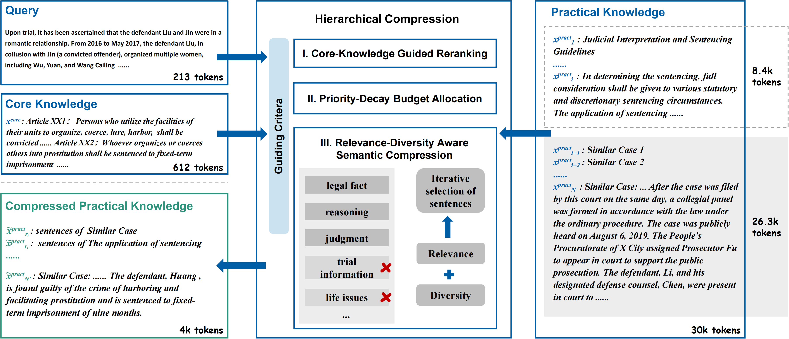

# HCLeK: Hierarchical Compression of Legal Knowledge for Retrieval-Augmented Generation

This is the official repository for the paper **"HCLeK: Hierarchical Compression of Legal Knowledge for Retrieval-Augmented Generation"**.

We are excited that our paper has been accepted as a short paper to the **34th ACM International Conference on Information and Knowledge Management (CIKM 2025)** 🎉.



## 💡 Abstract

Prompt compression for Retrieval-Augmented Generation (RAG) often fails by treating all retrieved information uniformly. This undifferentiated approach neglects the critical distinction between foundational core knowledge and illustrative practical knowledge, a failure especially damaging in hierarchical domains like law where essential principles can be discarded for redundant details, diminishing information gain.

To address this, we propose **HCLeK**, a Hierarchical Compression framework for Legal Knowledge. HCLeK uniquely leverages high-density core knowledge to guide the hierarchical compression of voluminous practical knowledge.
The framework operates in three stages: (1) **Core-Knowledge Guided Reranking** to prioritize practical knowledge based on its semantic relevance to core legal principles; (2) **Priority-Decay Budget Allocation** to dynamically assign compression budgets, focusing on the most salient information; and (3) **Relevance-Diversity Aware Semantic Compression** for fine-grained sentence-level compression.
Experimental results on the complex task of Legal Judgment Prediction (LJP) validate that HCLeK achieves state-of-the-art performance across various high compression ratios (0.5--0.05), demonstrating its effectiveness and robustness.

## 🚀 Getting Started
### 1. Prerequisites

Our framework (HCLeK) relies on a pre-trained large language model. Please download the base model weights first:

* **HuggingFace**: [Qwen/Qwen2.5-7B-Instruct-1M](https://huggingface.co/Qwen/Qwen2.5-7B-Instruct-1M)
* **ModelScope**: [Qwen/Qwen2.5-7B-Instruct-1M](https://www.modelscope.cn/models/Qwen/Qwen2.5-7B-Instruct-1M)

### 2. Installation

Clone this repository:
```bash
git clone [https://github.com/fupanY/HCLeK.git](https://github.com/fupanY/HCLeK.git)
cd HCLeK
```

Create and activate a conda environment (recommended):
```bash
conda create -n hclek python=3.9
conda activate hclek
```

Install the required dependencies:
```bash
pip install -r requirements.txt
```

### 3. Data Preparation

Download the dataset from Google Drive:
* **[Download HCLeK Dataset (Google Drive)](https://drive.google.com/drive/folders/1ColYVlACpSRVzoHmYgByOtFtM5i4Y-fO?usp=sharing)**

Place the data files under the `experiment/data/` directory.

### 4. Usage
Refer to the `experiment/` directory for scripts and instructions on running experiments.

## 📁 Repository Structure
```
.
├── experiment/       # Experiment scripts and data folders
├── HCLeK/            # Main source code for the HCLeK model
├── utils/            # Helper functions and utilities
├── requirements.txt  # Python dependencies
└── README.md         # This file
```


## 📜 License
This project is licensed under the Apache 2.0 License.